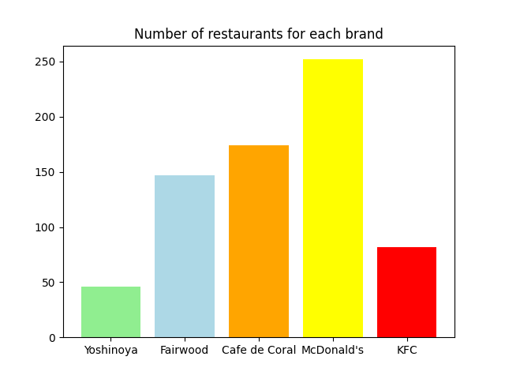

# Composite Geographic Site Scoring Model

Authors: [Algebra-FUN](https://github.com/Algebra-FUN),   [Nibblesin](https://github.com/Nibblesin)

Copyright © 2023 All Rights Reserved.

> Description on datasets can be found in [data/README.md](https://github.com/Annoying-MSDM5005/Site-Selection/blob/main/data/README.md)

## Basic strategy on site selection

**Learn the experience of site selection from your competitors.**

Hong Kong is a developed city with small area suitable for human habitation, almost every ecological niche is taken, so you can't find a new niche without competitors. Thus we have to accept this truth and confront with our competitors.

## Find potential candidate

Find potential candidate sites utilizing experience from other brands' restaurants

We collected the sites of all the restaurants of the following brands:

- Yoshinoya
- McDonald's
- Fairwood
- Cafe de Coral
- KFC

First of all, let visualize the distribution of the sites of Yoshinoya and other brands.

> From the above figure, we can see that the number of current site of Yoshinoya is less than other brands, so we can find more potential candidate sites for Yoshinoya to expand to confront other fast food brands.

Meanwhile, we also calculate the metric=(Median monthly income)\*(Working Population) to evaluate the potential purchasing power of each site.

We remove sites of other brands within 1km of Yoshinoya's restaurants. The remaining sites are potential candidate sites for Yoshinoya's new restaurants.

Rent is one of the most important factors to consider when choosing a store location, as the price of rent directly affects the cost of opening a store and the profitability of the business.
Here are the average rent of each district:

## Modelling

Our model consists of 4 sub-models, each of them evaluates different measurement one should care for site selection.

| Sub model                    | Description                                                                                                                                                                                                                | Goal                                                                                       |
| ---------------------------- | -------------------------------------------------------------------------------------------------------------------------------------------------------------------------------------------------------------------------- | ------------------------------------------------------------------------------------------ |
| Modified Similiarity Score   | Measure the similarity between features of candidates and features of exsited Yoshinoya resturant                                                                                                                          | To evaluate how the candidate match the historical pattern of site selection of yoshinoya. |
| Potential Return Value Score | Measure the potential return by the potential purchase power of customers and average rent of shop in the candidate site                                                                                                   | To evaluate how much return if we invest and open a new restruant at this candidate site.  |
| GeoRecommend Model           | Use the customers rating of Yoshinoya and other fast food brands to build a recommend system, in this scenario, we treat each site or geoblock as a user.                                                                  | To evaluate how customers will rating if we open a new restruant at this candiate site     |
| Logistics Regression         | With the exsited distribution data of  Yoshinoya and other fast food brands and demographic data of each site or geoblock, use Logistics Model to regress the likelihood whether there should be a new fast food resturant | To evaluate the likelihood whether one site should have a new fast food restraunt.         |

We linear combine the output score of each sub-model with weight:

$$
Score=\sum_k\omega_k M_k
$$

where $\omega_k$ is the weight of output of the $k^{th}$ model and $M_k$ is the functor of the $k^{th}$ sub-model.

### Modified Similiarity Score

Define the feature of each candidate and current yoshinoya as the feature of the corresponding district in dataset "DCCA_21C.json" which includes data of demography and incomes.

First, let us define the "Modified Similiarity Score" $S$ between the feature of $i^{th}$ feature $Y_i$ and the average feature of current yoshinoya $\bar{X}$ as:

$$
S(Y_i) = \cos(Y_i,\bar{X})\cdot\sqrt{\frac1{\gamma}\frac{d_i}{d_{\min}}-1}
$$

where $\cos(\cdot,\cdot)$ is the cosine similarity function, $d_i$ is the distance between candidate site and the nearest current yoshinoya, and $d_{\min}$ is the excluded distance and the $\gamma$ is a hyparameter for closeness penalty.

This the "Modified Similiarity Score" measures how the candidate match the historical standard of stores' site choosing of yoshinoya.

### GeoRecommend Model

We treat each geoblock as a user in the recommend model named as GeoUser.

Then we can construct a Table for the recommend model like this:

|           | Brand_1 | Brand_2 | Brand_3 | Brand_4 | Brand_5 |
| --------- | ------- | ------- | ------- | ------- | ------- |
| GeoUser 1 | 2/5     |         |         | 3/5     | 4/5     |
| GeoUser 2 | 1/5     | 1/5     | 2/5     |         |         |
| GeoUser 3 |         |         |         | 5/5     | 3/5     |

There are many different recommend algorithm on rating prediction, for simplification, we just use the most naive one, since you don't pay us for work.

#### Rating Predictions

Let the $r_{ij}$ be the rating of the $i^{th}$ GeoUser on $j^{th}$ brand.

Then we can predict $r_{ij}$ with the formula:

$$
r_{ij} = \frac{\sum_ks_{ki}r_{kj}}{\sum_ks_{ki}}
$$

where $s_{ki}$ is the similarity between $k^{th}$ GeoUser and $j^{th}$ GeoUser.

For simplification, we can use the cosine similarity

$$
s_{ij} = \cos(r_{i:},r_{j:})
$$

Then, we can predict how customers will rating if we open a new restruant at candiate sites.

### Potential Return Value Score

Second, we define the "Potential Purchasing Power" $P$ of each candidate site as:

$$
P(Y_i) = I_i*W_i
$$

where $I_i$ is the median monthly income of the $i^{th}$ candidate site and $W_i$ is the working population of the $i^{th}$ candidate site.

The convenience of transportation is an important factor in site selection, so we will take the distance from the subway station into consideration.

Using sigmoid function, the score $M(Y_i)$ is defined as

$$
M(Y_i) =  1 / (1 + exp((d_i - threshold) / slope))
$$

where $d_i$ represents the distance from the nearest subway station, threshold and slope are parameters that need to be adjusted.

Then, we define the "Value" $V$ of each candidate site as:

$$
V(Y_i) = \omega_S S(Y_i) + \omega_P \frac{P(Y_i)}{R(Y_i)} + \omega_M M(Y_i)
$$

where $R(Y_i)$ is the average rent of the $i^{th}$ candidate site,
$\omega_S$ and $\omega_P$ are hyparameters for the weight of "Modified Similiarity Score" and "Potential Purchasing Power" respectively.

Best ten candidates:

## Top 5 Sites Introduction in Chinese

#### LOHAS PARK, SAI KUNG

日出康城由港铁公司策划，各期由不同发展商兴建，是一个包括住宅、商场、公园、海滨长廊的铁路上盖综合发展。整个区域背山面海，西面及南面均为大海，东面及北面则为山（其中东面为清水湾郊野公园，[1]目前区内有多幅土地正兴建私人住宅，住户多为中产家庭，据《2016 中期人口统计》报告显示，日出康城家庭月入中位数为 57,210 港元[2]，较全港月入中位数 25,000 元高[2]，亦有约 13%非华裔外籍人口（不计外佣）居住。

#### Yiu Sha Rd, TAI PO

耀沙路（Yiu Sha Road），位於新界沙田區馬鞍山白石半島與落禾沙之間，西始烏溪沙路／長庚村通道交界迴旋處，經過迎海第四期迎海 • 御峰、渡頭灣村通道、雲海、城市大學白石學生宿舍地盤、泓碧通道／彩沙街路口、星連海、通往落禾沙里未命名路迴旋處、Silversands，東接白石俱樂部通道。

#### Tung Chung Waterfront Road, ISLANDS

东涌海滨路（英语：Tung Chung Waterfront Road）是香港离岛区大屿山北部沿海的一条街道，主要是行车道，前身是新填海区。东涌海滨路东至迎禧路，西至顺东路及赤鱲角南路交汇处。东涌海滨路之中途，经过北大屿山快速公路行车天桥、东涌新发展码头、渡轮码头旁之的士站、巴士站、新建成的东涌海滨长廊、海堤湾畔第三期、惠东路及行人天桥及怡东路止。

#### Gillies Avenue, KOWLOON CITY

機利士路（英語：Gillies Avenue）是香港九龍紅磡至鶴園一帶的其中一條道路，分為南北兩段，分別稱為機利士南路和機利士北路，以佛光街為分界，現時已不相通。道路以黃埔船塢高級職員機利士（Gillies）命名。機利士南路由佛光街至差館里的一段已改建成行人道（2011 年重新通車，但只限九龍英基小學的校巴可以使用該路段，其他車輛不能駛入），只剩下北至差館里、南至紅磡南道與暢運道交界的一段可以行車，當中蕪湖街以北的一段為單向南行，其餘路段雙向行車。車輛亦可從漆咸道北北行經地底行車隧道進入機利士南路的北段。

#### Chatham Road, KOWLOON CITY

漆咸道（英语：Chatham Road）是香港九龙区的一条主要道路，分为漆咸道南（英语：Chatham Road South）及漆咸道北（英语：Chatham Road North）两段。漆咸道以前由讯号山一带连接到红磡及老龙坑一带，现时已延长至土瓜湾。延长段由于其地理位置，所以命名为漆咸道北，而原来的一段则更名为漆咸道南。当中漆咸道南是一条南北走向的道路，南至梳士巴利道，北至加士居道、公主道及康庄道交界。而漆咸道北则由康庄道桥底向北伸延，连接马头围道及东九龙走廊往九龙湾与观塘。介乎加士居道至康庄道之间的漆咸道南，和介乎康庄道至东九龙走廊之间的漆咸道北是香港 5 号干线的一部分，由于可经康庄道连接红磡海底隧道前往香港岛，加上来往东西九龙的车流，该段道路交通经常严重挤塞。
